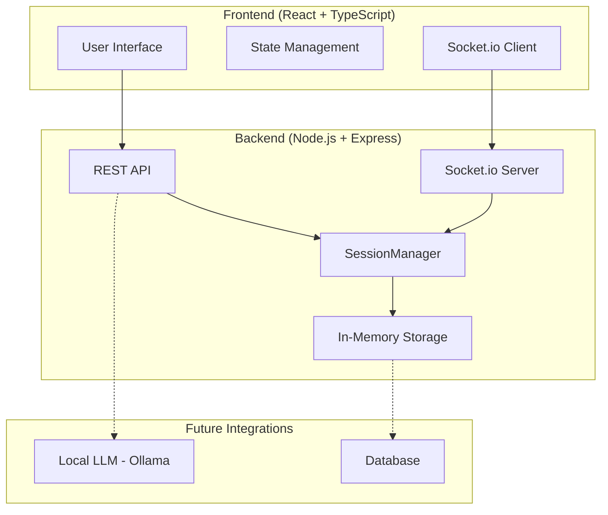
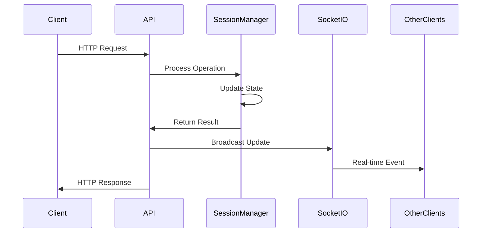
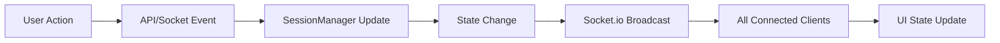
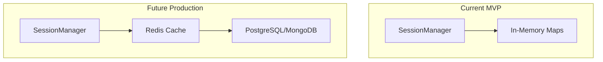
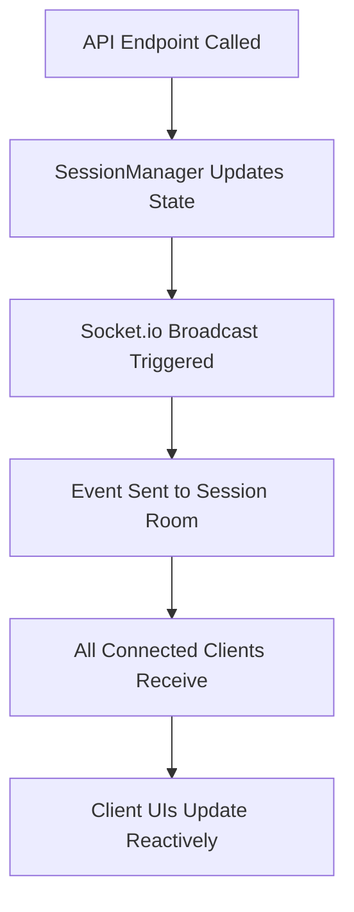
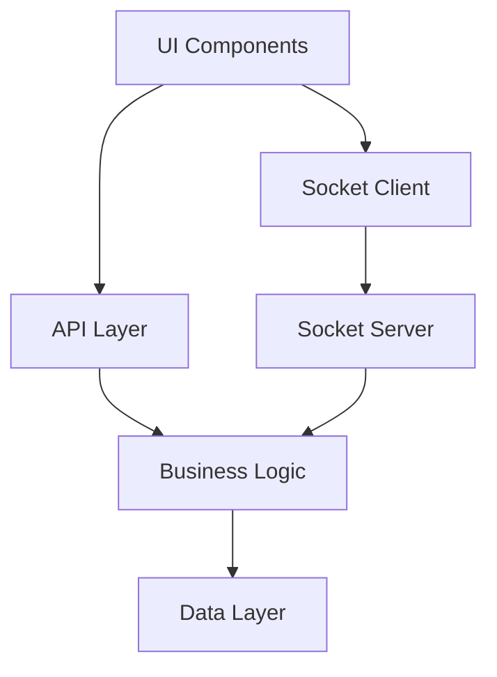
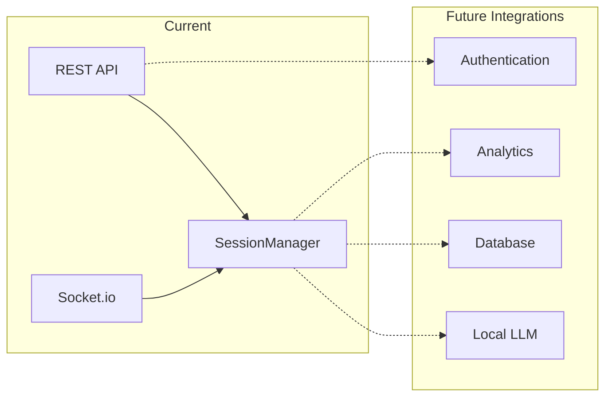
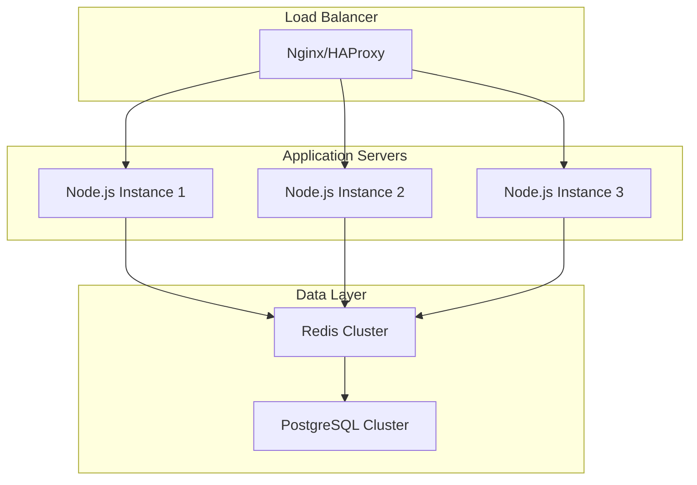
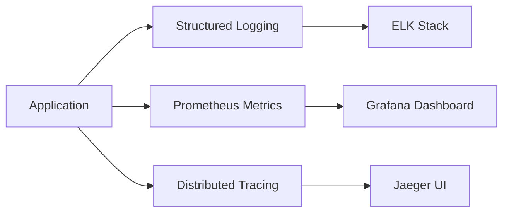

# Architecture Overview

> High-level system design and component relationships for letscatchup.ai

## 🏗️ System Architecture

### High-Level Overview


## 🎯 Core Components

### 1. **SessionManager** (Business Logic Core)
```typescript
// Central service managing all session operations
class SessionManager {
  private currentSession: PlanningSession | null = null;
  
  // Core operations
  createSession(description: string, creatorName: string)
  joinSession(sessionId: string, name: string)
  addKeyword(sessionId: string, userId: string, text: string, category: CategoryType)
  vote(sessionId: string, userId: string, keywordId: string, value: VoteValue)
  
  // State management
  getSession(sessionId: string): PlanningSession | null
  serializeSession(session: PlanningSession): SessionData
  
  // Lifecycle management
  cleanupExpiredSession()
  scheduleCleanup(expiresAt: Date)
}
```

**Responsibilities**:
- Session lifecycle management
- Participant management
- Keyword and voting operations
- Consensus detection
- Data validation and business rules

### 2. **REST API Layer** (HTTP Interface)
```typescript
// Express routes providing HTTP endpoints
sessionRouter.get('/health')                    // Service health check
sessionRouter.post('/create')                   // Create new session
sessionRouter.post('/:sessionId/join')          // Join existing session
sessionRouter.get('/:sessionId')                // Get session data
sessionRouter.post('/:sessionId/keywords')      // Add keywords
sessionRouter.post('/:sessionId/vote')          // Submit votes
sessionRouter.get('/:sessionId/participants')   // Get participants
```

**Responsibilities**:
- HTTP request handling
- Input validation and sanitization
- Response formatting
- Error handling and status codes
- Integration with real-time layer

### 3. **Socket.io Real-time Layer** (WebSocket Interface)
```typescript
// Real-time event handling
setupSocketHandlers(io: Server) {
  // Connection management
  socket.on('connect')
  socket.on('disconnect')
  
  // Session events
  socket.on('join-session')
  socket.on('add-keyword')
  socket.on('vote')
  socket.on('typing')
  
  // Broadcasting functions
  broadcastSessionUpdate()
  broadcastKeywordAdded()
  broadcastVoteUpdate()
  broadcastConsensusReached()
}
```

**Responsibilities**:
- Real-time communication
- Event broadcasting to session rooms
- Connection state management
- Live collaboration features

## 📊 Data Flow Architecture

### Request Processing Flow


### State Synchronization Pattern


## 🗄️ Data Storage Architecture

### Current: In-Memory Storage
```typescript
// SessionManager internal storage
class SessionManager {
  private currentSession: PlanningSession | null = null;
  
  // Session contains:
  // - participants: Map<string, Participant>
  // - keywords: Map<string, Keyword>
  // - Each keyword has votes: Map<string, Vote>
}
```

**Benefits**:
- Zero setup complexity
- Fast read/write operations
- Perfect for MVP demonstration
- No external dependencies

**Limitations**:
- Data lost on server restart
- Single server instance only
- No persistence across sessions

### Future: Database Integration


## 🔄 Event-Driven Architecture

### Event Types and Flow
```typescript
// API Events → Socket.io Broadcasting
interface EventFlow {
  // User joins session
  'POST /join' → 'participant-joined' → All participants
  
  // Keyword added
  'POST /keywords' → 'keyword-added' → All participants
  
  // Vote submitted  
  'POST /vote' → 'vote-updated' → All participants
  
  // Consensus reached
  Vote triggers consensus → 'consensus-reached' → All participants
}
```

### Real-time Event Broadcasting


## 🏛️ Layered Architecture

### Layer Separation
```
┌─────────────────────────────────────┐
│           Presentation Layer        │
│     (React Components, UI Logic)    │
├─────────────────────────────────────┤
│           API Layer                 │
│    (Express Routes, Validation)     │
├─────────────────────────────────────┤
│         Business Logic Layer        │
│      (SessionManager, Rules)        │
├─────────────────────────────────────┤
│         Data Access Layer           │
│     (In-Memory Maps, Future DB)     │
├─────────────────────────────────────┤
│        Infrastructure Layer         │
│   (Socket.io, Express, Node.js)     │
└─────────────────────────────────────┘
```

### Dependency Flow


## 🔌 Integration Points

### Current Integrations
```typescript
// Express + Socket.io Integration
const server = createServer(app);
const io = new Server(server);

// API + Real-time Integration
app.post('/keywords', (req, res) => {
  const result = sessionManager.addKeyword(...);
  broadcastKeywordAdded(sessionId, result.id, io); // Real-time
  res.json(result); // HTTP response
});
```

### Future Integration Points


## 🚀 Scalability Considerations

### Current MVP Limitations
- Single server instance
- In-memory storage only
- No horizontal scaling
- Session limit: 1 active session

### Future Scaling Strategy


## 🔒 Security Architecture

### Current Security Model
- No authentication (MVP)
- Input validation at API layer
- CORS enabled for development
- Basic error handling

### Future Security Enhancements
```typescript
// Authentication middleware
app.use('/api/session', authenticateUser);

// Rate limiting
app.use(rateLimit({
  windowMs: 15 * 60 * 1000, // 15 minutes
  max: 100 // limit each IP to 100 requests per windowMs
}));

// Session-based access control
function validateSessionAccess(sessionId: string, userId: string) {
  // Verify user belongs to session
}
```

## 📈 Monitoring & Observability

### Current Logging
```typescript
// Basic console logging
console.log(`📝 Session created: "${description}" by ${creatorName}`);
console.log(`👋 ${name} joined session: ${session.description}`);
console.log(`🗳️ ${participant.name} voted ${value > 0 ? '+1' : '-1'} on "${keyword.text}"`);
```

### Future Monitoring Stack


---

**Implementation Status**: Backend Complete, Frontend Next  
**Last Updated**: 2025-07-13
