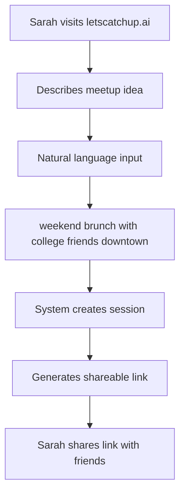
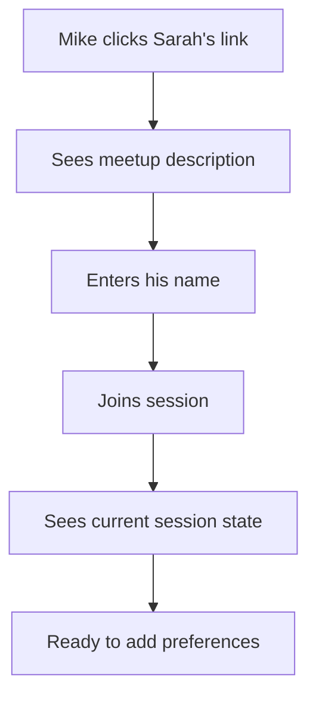
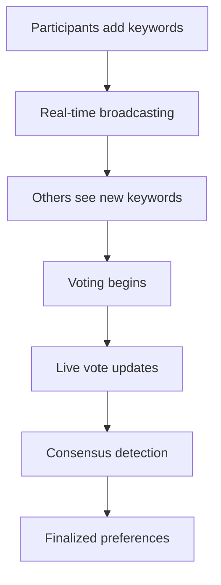
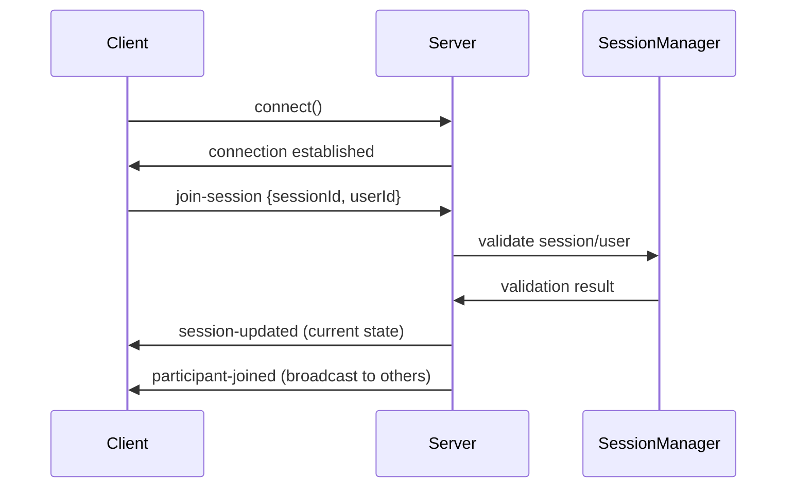
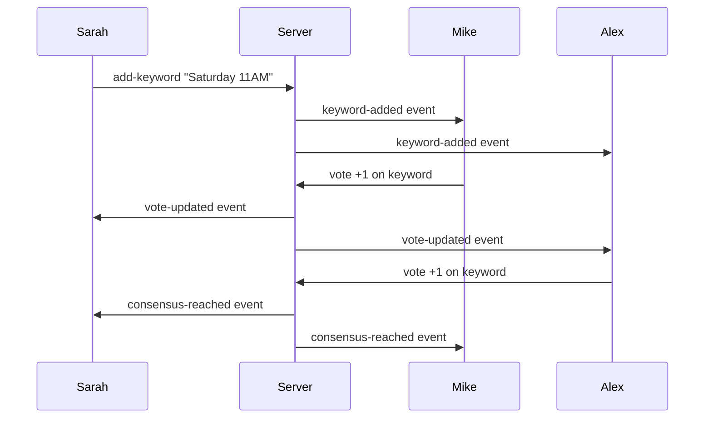
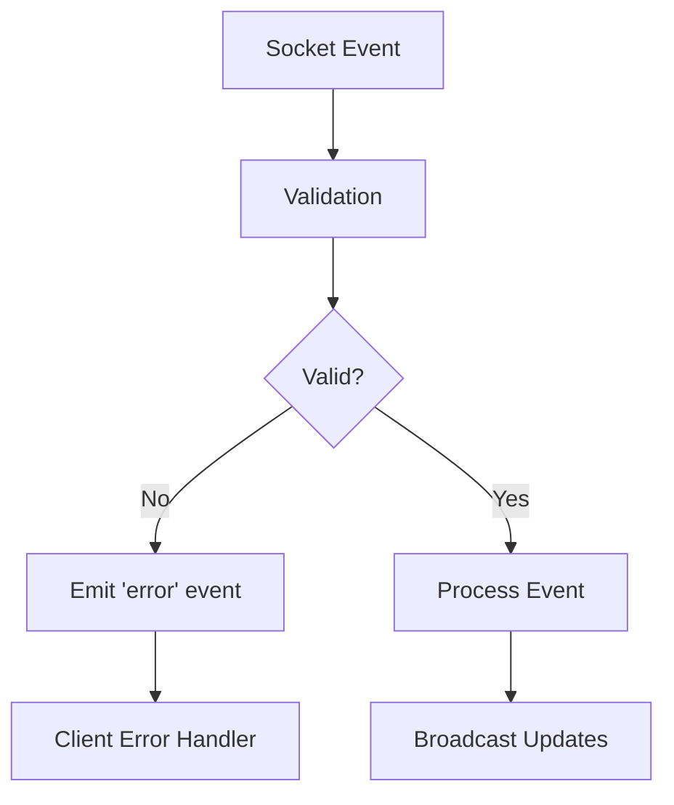
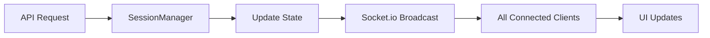

# Control Flow & User Journeys

> Complete user workflows and system control flow for letscatchup.ai

## 🎯 User Journey Overview

### 👤 Personas
- **Sarah** (Creator): Initiates meetup planning
- **Mike, Alex, Emma** (Friends): Join and collaborate

### 🌊 Three-Stage Flow
1. **Creator Interface**: Sarah describes meetup idea
2. **Friend Onboarding**: Friends join with personalized questions  
3. **Live Collaborative Arena**: Real-time preference matching

## 📋 Stage 1: Creator Interface

### Sarah's Journey


### Backend Flow
```typescript
// 1. Session Creation
POST /api/session/create
{
  description: "weekend brunch with college friends downtown",
  creatorName: "Sarah"
}

// 2. SessionManager Processing
sessionManager.createSession(description, creatorName)
├── Generate unique session ID ('current' for MVP)
├── Create Participant object for Sarah
├── Initialize empty keywords Map
├── Set 24-hour expiration timer
└── Return session details

// 3. Response
{
  sessionId: "current",
  shareLink: "/join/current", 
  userId: "user_abc123"
}
```

## 👋 Stage 2: Friend Onboarding Flow

### Mike's Journey


### Backend Flow
```typescript
// 1. Join Session
POST /api/session/current/join
{
  name: "Mike"
}

// 2. SessionManager Processing  
sessionManager.joinSession(sessionId, name)
├── Validate session exists and is active
├── Generate unique user ID
├── Create Participant object
├── Add to session participants Map
└── Return complete session state

// 3. Real-time Broadcasting
Socket.io Events:
├── 'participant-joined' → All other participants
├── 'session-updated' → Joining user
└── 'participant-count-updated' → All participants
```

## 🎪 Stage 3: Live Collaborative Arena

### Real-time Collaboration Flow


### Keyword Addition Flow
```typescript
// 1. Add Keyword (via API or Socket)
POST /api/session/current/keywords
{
  userId: "user_abc123",
  text: "Saturday 11AM", 
  category: "time"
}

// 2. SessionManager Processing
sessionManager.addKeyword(sessionId, userId, text, category)
├── Validate session and user exist
├── Generate unique keyword ID
├── Create Keyword object with empty votes Map
├── Add to session keywords Map
└── Return keyword details

// 3. Real-time Broadcasting
Socket.io Events:
├── 'keyword-added' → All participants
└── 'session-stats-updated' → All participants
```

### Voting Flow
```typescript
// 1. Vote Submission
POST /api/session/current/vote
{
  userId: "user_def456",
  keywordId: "keyword_xyz789",
  value: 1
}

// 2. SessionManager Processing
sessionManager.vote(sessionId, userId, keywordId, value)
├── Validate session, user, and keyword exist
├── Create/Update Vote object
├── Recalculate keyword total score
├── Check for consensus
└── Return vote results

// 3. Consensus Detection
checkConsensus(keyword, totalParticipants)
├── Minimum 2 votes required
├── ≥60% positive votes (value: 1)
├── <25% negative votes (value: -1)
└── Move to consensus.finalized if met

// 4. Real-time Broadcasting
Socket.io Events:
├── 'vote-updated' → All participants
├── 'consensus-reached' → All participants (if consensus)
└── 'session-stats-updated' → All participants
```

## 🔄 Real-time Event Flow

### Socket.io Connection Flow


### Live Collaboration Sequence


## 🎯 Consensus Algorithm Flow

### Decision Making Process
```typescript
function consensusFlow(keyword: Keyword, session: PlanningSession) {
  // 1. Vote Collection Phase
  const votes = Array.from(keyword.votes.values());
  const totalParticipants = session.participants.size;
  
  // 2. Threshold Checks
  if (votes.length < 2) return 'insufficient-votes';
  
  // 3. Ratio Calculations
  const positiveVotes = votes.filter(v => v.value === 1).length;
  const negativeVotes = votes.filter(v => v.value === -1).length;
  const positiveRatio = positiveVotes / totalParticipants;
  const negativeRatio = negativeVotes / totalParticipants;
  
  // 4. Consensus Decision
  if (positiveRatio >= 0.6 && negativeRatio < 0.25) {
    return 'consensus-reached';
  }
  
  return 'pending';
}
```

## 🚨 Error Handling Flow

### Session Validation
```typescript
// Every operation validates:
1. Session exists and is active
2. Session hasn't expired (24-hour limit)
3. User is a valid participant
4. Request data is properly formatted

// Error responses:
├── 404: Session not found
├── 400: Invalid request data
├── 403: User not authorized
└── 500: Server error
```

### Socket.io Error Flow


## ⏰ Session Lifecycle

### Automatic Cleanup Flow
```typescript
// Session Creation
createSession() 
├── Set expiresAt = now + 24 hours
├── Schedule cleanup timer
└── Start hourly cleanup check

// Cleanup Process
cleanupExpiredSession()
├── Check if current time > expiresAt
├── Clear session data from memory
├── Clear cleanup timer
└── Log cleanup action

// Manual Cleanup (new session)
├── Clear existing session
├── Reset all timers
└── Initialize new session
```

## 📊 Data Flow Patterns

### State Synchronization


### Event-Driven Architecture
```typescript
// Pattern: Action → State Change → Broadcast → UI Update
1. User Action (API/Socket)
2. SessionManager State Update
3. Real-time Broadcast to Room
4. Client State Synchronization
5. Reactive UI Updates
```

---

**Implementation**: `backend/src/services/SessionManager.ts`, `backend/src/sockets/sessionSocket.ts`  
**Last Updated**: 2025-07-13
